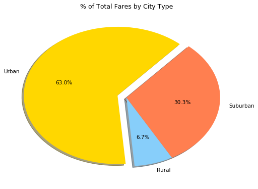

```python
# Dependencies
import matplotlib.pyplot as plt
import pandas as pd

# Read csv files
city_data = pd.read_csv("../Pyber/raw_data/city_data.csv")
city_df = pd.DataFrame(city_data)

ride_data = pd.read_csv("../Pyber/raw_data/ride_data.csv")
ride_df = pd.DataFrame(ride_data)

# Check ride data count
ride_df.count()
```


    city       2375
    date       2375
    fare       2375
    ride_id    2375
    dtype: int64


```python
# Merge both dataframes
merge_df = pd.merge(ride_df, city_df, how="left", on=["city"])

# View merged dataframe
merge_df.head(10)
```


<div>
<style>
    .dataframe thead tr:only-child th {
        text-align: right;
    }

    .dataframe thead th {
        text-align: left;
    }

    .dataframe tbody tr th {
        vertical-align: top;
    }
</style>
<table border="1" class="dataframe">
  <thead>
    <tr style="text-align: right;">
      <th></th>
      <th>city</th>
      <th>date</th>
      <th>fare</th>
      <th>ride_id</th>
      <th>driver_count</th>
      <th>type</th>
    </tr>
  </thead>
  <tbody>
    <tr>
      <th>0</th>
      <td>Sarabury</td>
      <td>2016-01-16 13:49:27</td>
      <td>38.35</td>
      <td>5403689035038</td>
      <td>46</td>
      <td>Urban</td>
    </tr>
    <tr>
      <th>1</th>
      <td>South Roy</td>
      <td>2016-01-02 18:42:34</td>
      <td>17.49</td>
      <td>4036272335942</td>
      <td>35</td>
      <td>Urban</td>
    </tr>
    <tr>
      <th>2</th>
      <td>Wiseborough</td>
      <td>2016-01-21 17:35:29</td>
      <td>44.18</td>
      <td>3645042422587</td>
      <td>55</td>
      <td>Urban</td>
    </tr>
    <tr>
      <th>3</th>
      <td>Spencertown</td>
      <td>2016-07-31 14:53:22</td>
      <td>6.87</td>
      <td>2242596575892</td>
      <td>68</td>
      <td>Urban</td>
    </tr>
    <tr>
      <th>4</th>
      <td>Nguyenbury</td>
      <td>2016-07-09 04:42:44</td>
      <td>6.28</td>
      <td>1543057793673</td>
      <td>8</td>
      <td>Urban</td>
    </tr>
    <tr>
      <th>5</th>
      <td>New Jeffrey</td>
      <td>2016-02-22 18:36:25</td>
      <td>36.01</td>
      <td>9757888452346</td>
      <td>58</td>
      <td>Urban</td>
    </tr>
    <tr>
      <th>6</th>
      <td>Port Johnstad</td>
      <td>2016-06-07 02:39:58</td>
      <td>17.15</td>
      <td>4352278259335</td>
      <td>22</td>
      <td>Urban</td>
    </tr>
    <tr>
      <th>7</th>
      <td>Jacobfort</td>
      <td>2016-09-20 20:58:37</td>
      <td>22.98</td>
      <td>1500221409082</td>
      <td>52</td>
      <td>Urban</td>
    </tr>
    <tr>
      <th>8</th>
      <td>Travisville</td>
      <td>2016-01-15 17:32:02</td>
      <td>27.39</td>
      <td>850152768361</td>
      <td>37</td>
      <td>Urban</td>
    </tr>
    <tr>
      <th>9</th>
      <td>Sandymouth</td>
      <td>2016-11-16 07:27:00</td>
      <td>21.61</td>
      <td>2389035050524</td>
      <td>11</td>
      <td>Urban</td>
    </tr>
  </tbody>
</table>
</div>


```python
# Check data count of merged data
merge_df.count()
```


    city            2407
    date            2407
    fare            2407
    ride_id         2407
    driver_count    2407
    type            2407
    dtype: int64


```python
# Look for duplicate value
city_df["city"].value_counts()
```


    Port James              2
    Anitamouth              1
    North Tara              1
    Eriktown                1
    Port Guytown            1
    New Lynn                1
    Hernandezshire          1
    West Alexis             1
    West Peter              1
    South Roy               1
    Lake Brenda             1
    West Jefferyfurt        1
    Carrollbury             1
    Lake Jennaton           1
    West Paulport           1
    Sandymouth              1
    Kyleton                 1
    Williamshire            1
    Lisatown                1
    Kellershire             1
    Alyssaberg              1
    New Jessicamouth        1
    West Sydneyhaven        1
    North Tracyfort         1
    Kelseyland              1
    Antoniomouth            1
    Horneland               1
    Conwaymouth             1
    West Brittanyton        1
    Kennethburgh            1
                           ..
    New Michelleberg        1
    Maryside                1
    New Brandonborough      1
    Carrollfort             1
    Thomastown              1
    Fosterside              1
    Torresshire             1
    Port Josephfurt         1
    Pamelahaven             1
    Johnland                1
    Jasonfort               1
    East Stephen            1
    Aprilchester            1
    Rodriguezburgh          1
    Campbellport            1
    Rodriguezview           1
    Davistown               1
    Jacksonfort             1
    South Shannonborough    1
    South Elizabethmouth    1
    New Samanthaside        1
    Williamchester          1
    Tiffanyton              1
    Spencertown             1
    East Erin               1
    Martinmouth             1
    Port Jose               1
    Floresberg              1
    South Louis             1
    Alvarezhaven            1
    Name: city, Length: 125, dtype: int64


```python
# Obtain rows for duplicated value
city_df[city_df["city"] == "Port James"]
```


<div>
<style>
    .dataframe thead tr:only-child th {
        text-align: right;
    }

    .dataframe thead th {
        text-align: left;
    }

    .dataframe tbody tr th {
        vertical-align: top;
    }
</style>
<table border="1" class="dataframe">
  <thead>
    <tr style="text-align: right;">
      <th></th>
      <th>city</th>
      <th>driver_count</th>
      <th>type</th>
    </tr>
  </thead>
  <tbody>
    <tr>
      <th>84</th>
      <td>Port James</td>
      <td>15</td>
      <td>Suburban</td>
    </tr>
    <tr>
      <th>100</th>
      <td>Port James</td>
      <td>3</td>
      <td>Suburban</td>
    </tr>
  </tbody>
</table>
</div>


```python
# Remove duplicate from data
city_cleanup = city_df[city_df.city != "Port James"]
port_james = pd.DataFrame({"city": "Port James", "driver_count": 18, "type": "Suburban"}, index=[0])
city_dfs = [city_cleanup, port_james]
city_new = pd.concat(city_dfs)

# Check for updated value
city_new[city_new["city"] == "Port James"]
```


<div>
<style>
    .dataframe thead tr:only-child th {
        text-align: right;
    }

    .dataframe thead th {
        text-align: left;
    }

    .dataframe tbody tr th {
        vertical-align: top;
    }
</style>
<table border="1" class="dataframe">
  <thead>
    <tr style="text-align: right;">
      <th></th>
      <th>city</th>
      <th>driver_count</th>
      <th>type</th>
    </tr>
  </thead>
  <tbody>
    <tr>
      <th>0</th>
      <td>Port James</td>
      <td>18</td>
      <td>Suburban</td>
    </tr>
  </tbody>
</table>
</div>


```python
# Merge corrected data
merge_cleanup = pd.merge(ride_df, city_new, how="left", on=["city"])

# Check data count
merge_cleanup.count()
```


    city            2375
    date            2375
    fare            2375
    ride_id         2375
    driver_count    2375
    type            2375
    dtype: int64


```python
# Split dataframe by city types
urban_data = merge_cleanup.loc[merge_cleanup["type"] == "Urban"]
suburban_data = merge_cleanup.loc[merge_cleanup["type"] == "Suburban"]
rural_data = merge_cleanup.loc[merge_cleanup["type"] == "Rural"]

# Calculate urban data
urban_avg_fare = urban_data.groupby(["city"]).mean()["fare"]
urban_ride_count = urban_data.groupby(["city"]).count()["ride_id"]
urban_num_drivers = urban_data.groupby(["city"]).max()["driver_count"]

# Calculate suburban data
suburban_avg_fare = suburban_data.groupby(["city"]).mean()["fare"]
suburban_ride_count = suburban_data.groupby(["city"]).count()["ride_id"]
suburban_num_drivers = suburban_data.groupby(["city"]).max()["driver_count"]

# Calculate rural data
rural_avg_fare = rural_data.groupby(["city"]).mean()["fare"]
rural_ride_count = rural_data.groupby(["city"]).count()["ride_id"]
rural_num_drivers = rural_data.groupby(["city"]).max()["driver_count"]

# Plot bubble chart
plt.figure(figsize=(8,6), dpi=75)
urban = plt.scatter(urban_ride_count, urban_avg_fare, marker="o", s=urban_num_drivers*10, facecolors="gold", alpha=0.6, 
                     linewidth=2, edgecolors="black", label="Urban")
suburban = plt.scatter(suburban_ride_count, suburban_avg_fare, marker="o", s=suburban_num_drivers*10, facecolors="lightskyblue", alpha=0.6, 
                     linewidth=2, edgecolors="black", label="Suburban")
rural = plt.scatter(rural_ride_count, rural_avg_fare, marker="o", s=rural_num_drivers*10, facecolors="coral", alpha=0.6, 
                     linewidth=2, edgecolors="black", label="Rural")

# Add title, labels, and legend
plt.title("Pyber Ride Sharing Data (2016)")
plt.xlabel("Total Number of Rides (Per City)")
plt.ylabel("Average Fare($)")
bubble_legend = plt.legend(handles=[urban, suburban, rural], title="City Types", loc="upper right")
bubble_legend.legendHandles[0]._sizes = [30]
bubble_legend.legendHandles[1]._sizes = [30]
bubble_legend.legendHandles[2]._sizes = [30]

# Format bubble chart for aesthetics
plt.grid()
plt.xlim(0,40)
plt.ylim(5,60)
plt.show()
```


```python
# % of total fares by city type
total_fares = merge_cleanup.groupby(["type"]).sum()["fare"]
colors = ["lightskyblue", "coral", "gold"]
explode = [0,0,0.1]
fare_labels = total_fares.keys()

# Plot pie chart
plt.figure(figsize=(8,6), dpi=75)
plt.pie(total_fares, labels=fare_labels, explode=explode, colors=colors, startangle=275, autopct="%1.1f%%", 
        shadow=True)

# Add title
plt.title("% of Total Fares by City Type")

plt.show()
```





```python
# % of total rides by city type
total_rides = merge_cleanup.groupby(["type"]).count()["ride_id"]
colors = ["lightskyblue", "coral", "gold"]
explode = [0,0,0.1]
rides_labels = total_rides.keys()

# Plot pie chart
plt.figure(figsize=(8,6), dpi=75)
plt.pie(total_rides, labels=rides_labels, explode=explode, colors=colors, startangle=275, autopct="%1.1f%%", 
        shadow=True)

# Add title
plt.title("% of Total Rides by City Type")

plt.show()
```


```python
# % of total drivers by city type
total_drivers = merge_cleanup.groupby(["type"]).sum()["driver_count"]
colors = ["lightskyblue", "coral", "gold"]
explode = [0,0,0.2]
drivers_labels = total_drivers.keys()

# Plot pie chart
plt.figure(figsize=(8,6), dpi=75)
plt.pie(total_drivers, labels=drivers_labels, explode=explode, colors=colors, startangle=290, autopct="%1.1f%%", 
        shadow=True)

# Add title
plt.title("% of Total Drivers by City Type")

plt.show()
```


```python
# Three observable trends based on the data:
    
    # 1) There's significantly more drivers in urban cities than suburban and rural cities.
    
    # 2) The average fare for urban cities generally ranges between $20-$30.
    
    # 3) There's a rural city that logged both the fewest rides and the highest average fare (~50). This city is most
    #    likely very distant from urban areas that patrons would avoid using the ride sharing service due to high
    #    fares and distance.
```
